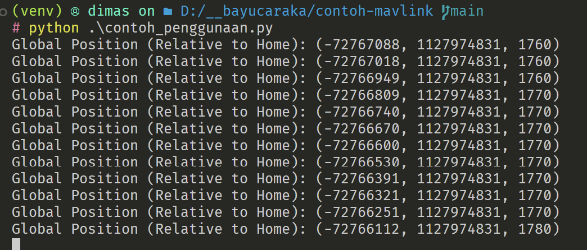

# Penugasan Flask + Mavlink serta Integrasi

struktur folder:

```
D:.
│   .gitignore
│   README.md
│   requirements.txt
│
├───client
│       index.html
│       main.js
│
├───img
│       output.png
│       setting.png
│       tcphost.png
│
└───server
        main.py
```

**folder:**
di mana folder client berisi program frontend kalian, dan folder server berisi program backend kalian.

kalian bebas menambahkan file apapun untuk membuat penugasan ini di folder client maupun server

# Setup Program

1. Clone repo ini
2. Jalankan `python -m venv venv` lalu install libraries dengan `pip install -r requirements.txt`
3. Ubah hal berikut di package dronekit `venv/Lib/site-packages/dronekit/__init__.py`,

- tambahkan kode berikut di line 38

```
import sys
if sys.version_info.major == 3 and sys.version_info.minor >=  10:
    from collections.abc import MutableMapping
else:
    from collections import MutableMapping
```

- lalu ubah di file yang sama sekitar line 2694, dari

```
class Parameters(collections.MutableMapping, HasObservers)
```

menjadi

```
class Parameters(MutableMapping, HasObservers)
```

# Setup Mission Planner

Buka mission planner dan connect ke plane seperti biasanya

Lalu ctrl+f dan pilih mavlink, terdapat di kolom paling kiri urutan ke 6 dari atas


Setelah itu set sebagai berikut


Setelah semuanya telah disetup, bisa langsung jalankan `contoh_penggunaan.py`

# Output


