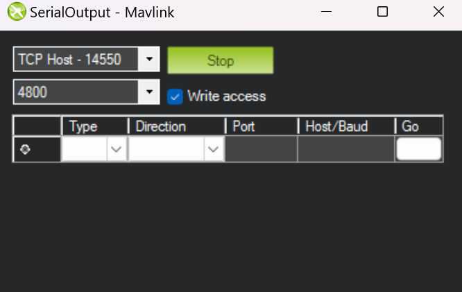

# Penugasan Flask + Mavlink serta Integrasi

struktur folder:

```
D:.
│   .gitignore
│   README.md
│   requirements.txt
│
├───client
│       index.html
│       main.js
│
├───img
│       output.png
│       setting.png
│       tcphost.png
│
└───server
        main.py
```

**folder:**
di mana folder `client` berisi program `frontend` kalian, dan folder `server` berisi program `backend` kalian.

kalian bebas menambahkan file apapun untuk membuat penugasan ini di folder client maupun server

**general flow:**

- cara menjalankan program saat sudah jadi secara general adalah
  - setup mission planner dan run mission
  - set mission planner menjadi tcp host agar dapat terkoneksi dengan backend
  - jalankan backend
  - jalankan frontend

# Setup Backend

1. Clone repo ini
2. Jalankan `python -m venv venv` lalu install libraries dengan `pip install -r requirements.txt`
3. Ubah hal berikut di package dronekit `venv/Lib/site-packages/dronekit/__init__.py`,

- tambahkan kode berikut di line 38

```
import sys
if sys.version_info.major == 3 and sys.version_info.minor >=  10:
    from collections.abc import MutableMapping
else:
    from collections import MutableMapping
```

- lalu ubah di file yang sama sekitar line 2694, dari

```
class Parameters(collections.MutableMapping, HasObservers)
```

menjadi

```
class Parameters(MutableMapping, HasObservers)
```

selesai, selamat ngoding backend!

# Setup Mission Planner

Buka mission planner dan connect ke plane seperti biasanya

Lalu ctrl+f dan pilih mavlink, terdapat di kolom paling kiri urutan ke 6 dari atas


Setelah itu set sebagai berikut


Setelah semuanya telah disetup, bisa langsung jalankan backend dan setelah itu buka frontend

# Extension di VSCode untuk mempermudah pengerjaan

### Live Server


untuk memudahkan kita bisa menggunakan live server saat mendevelop frontend. live server membuat kita bisa melihat perubahan secara langsung ketika kita mengubah file di client nantinya tanpa harus reload webnya tiap saat

### Thunder Client


untuk memudahkan saat mendevelop api / server. Kita bisa testing endpoint yang sudah kita buat langsung di vscode dengan menggunakan thunder client
